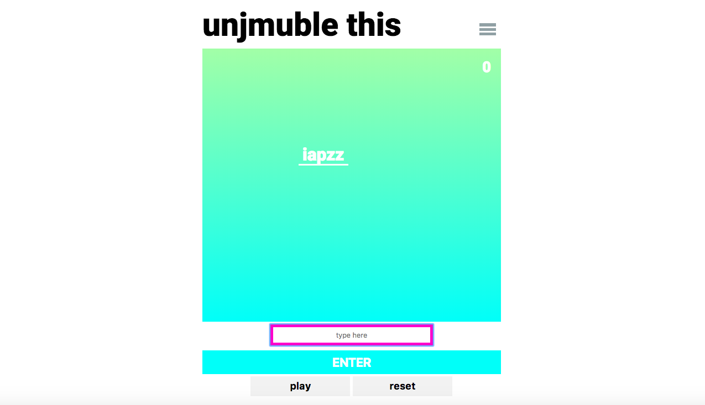
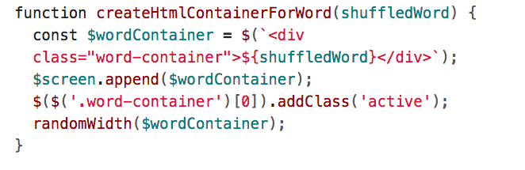
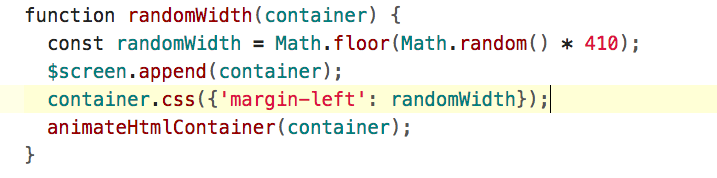
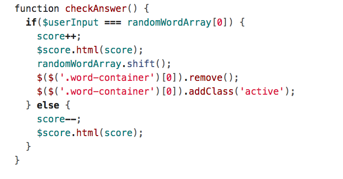

# WDI_PROJECT_1

## Unjmuble This

## Description 

"Unjmuble This" - The idea of the game is to un-jumble words within a specific time frame, the game becomes more challenging as it progresses and the speed increases. 

## Tech used / Stack

* HTML
* CSS
* JavaScript 
* jQuery

## Key Features

* A container is created for the word and a class of 'Active is added which means the word is in play, the class will be removed later if the user gets enters the correct word or when the word reaches the bottom of the screen.

* Function to make the word fall from different points at the top of the screen.

* If the users input is correct increase the score by one point and remove the class of active so the word is no longer in play, or if the user input is incorrect decrease the score by one point.

## Challenges

* The main challenge was getting all of the functions to take place in the correct order. I resolved this by calling each function at the end of the previous one. When the play button is clicked it sets off a chain reaction. 

## Improvements

* In addition to the speed increasing as the game progresses,  the interval time between words falling could decrease.
* The game could be made more interesting for users by introducing different levels, for instance creating a new environment with css. 
* Resolve some issues with the game reset. 
* I like the CSS as it is quite clean and simple, however I think more could be done 


